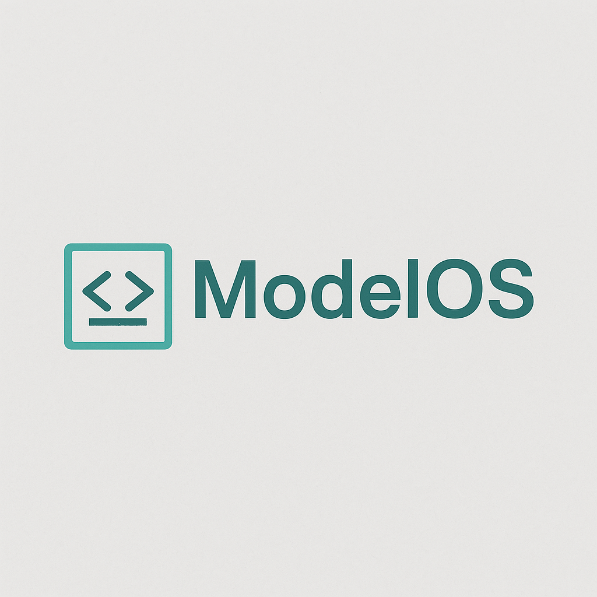

<p align="center">
  
</p>

<h1 align="center">🧠 ModelOS</h1>
<p align="center">
  Open Agent Execution Framework — visual, scriptable, and model-agnostic.
</p>

<p align="center">
  <a href="https://github.com/yourusername/modelos">
    
  </a>
  <a href="https://github.com/yourusername/modelos/blob/main/LICENSE">
    
  </a>
  <a href="https://github.com/yourusername/modelos/actions">
    
  </a>
</p>

---

## 📦 Structure

```
modelos/
├── modelos-visual-builder/         # Frontend (React + Tailwind)
├── ModelOS_Backend_With_Ollama/    # FastAPI backend with OpenAI & Ollama
├── ModelOS_CLI_Phase1_Complete_With_Logo/  # CLI SDK + MCP Logger
```

## 🚀 Get Started

```bash
git clone https://github.com/yourusername/modelos.git
cd modelos/modelos-visual-builder
npm install && npm run dev
```

In a new terminal:

```bash
cd modelos/ModelOS_Backend_With_Ollama
python3 -m venv venv && source venv/bin/activate
pip install -r requirements.txt
export OPENAI_API_KEY=sk-...
uvicorn server:app --reload
```

## ✨ Features

- Visual block-based agent builder
- CLI SDK with MCP schema logging
- FastAPI backend supporting OpenAI + Ollama
- Model-agnostic, extensible, and open

## 📄 License

MIT
